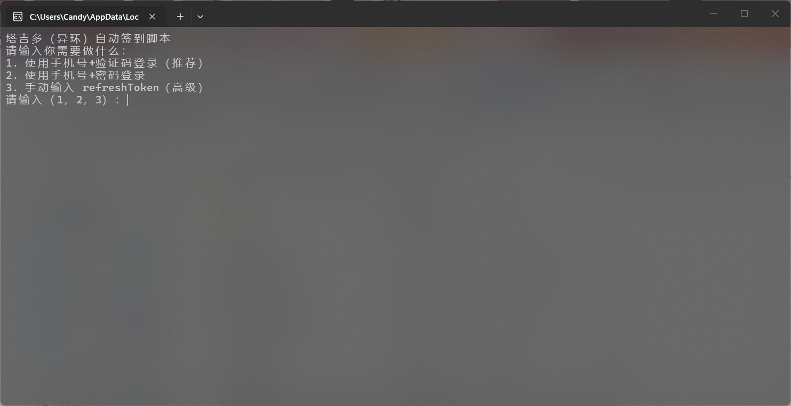
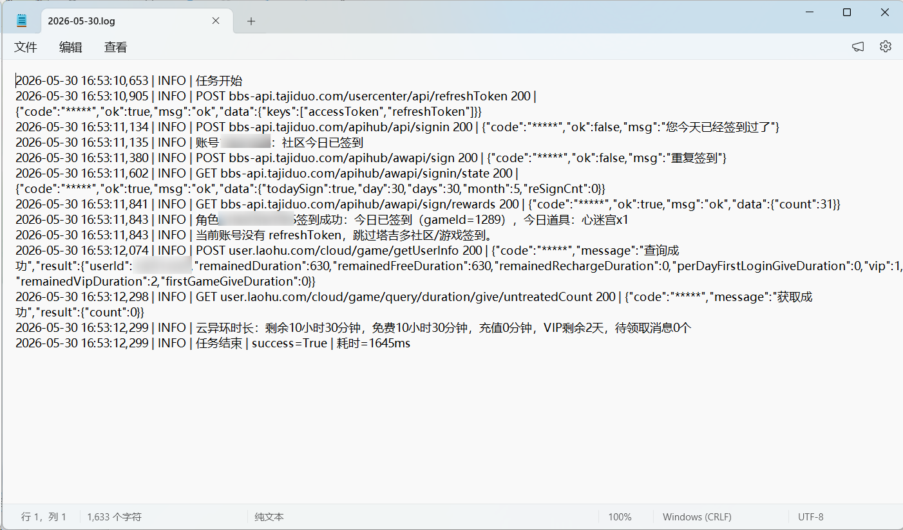

# NTE Auto Sign（塔吉多 / 异环）

NTE Auto Sign 是一个塔吉多（异环）自动签到工具，支持短信/refreshToken 登录、多账号管理与切换、社区+游戏签到、云异环每日时长领取、奖励日志输出，并提供 `nte.exe` 与 `add_account.exe` 便捷使用。

## 功能特性

- 手机号 + 短信验证码登录
- 手机号 + 密码登录
- `refreshToken` 登录（高级模式）
- 云异环手机号 + 短信验证码登录
- 多账号保存到 `TOKEN.txt`（每行一个账号）
- 运行时手动选择账号（单选 / 多选 / 全部）
- 社区签到 + 游戏签到
- 云异环每日首登时长领取与剩余时长查询
- 签到结果与奖励日志输出（`logs\YYYY-MM-DD.log`）

## 快速开始（Python）

1. 安装依赖

```bash
pip install -r requirements.txt
```

2. 添加账号（支持连续添加）

```bash
python add_account.py
```

3. 执行签到

```bash
python nte.py
```

## 账号文件（TOKEN.txt）

`TOKEN.txt` 每行一个账号，推荐使用 JSON：

```json
{"refreshToken":"xxx","uid":"10xxxx","deviceId":"xxxxx","gameId":"1289","roleIds":["2160xxxxxxx"]}
```

云异环账号可以只保存云时长领取所需字段：

```json
{"cloudToken":"xxx","cloudUserId":"152xxxx","cloudDeviceId":"xxxxx","deviceId":"xxxxx"}
```

同一个账号也可以同时保存塔吉多签到和云异环时长字段，运行时会自动执行两部分。

## 多账号运行

当 `TOKEN.txt` 中有多个账号时，`nte.py` / `nte.exe` 默认签到全部账号，适合双击运行。

如需手动选择账号，设置环境变量 `TGD_SELECT_ACCOUNTS=1` 后运行，会提示选择：

- `1`：只签到第 1 个账号
- `1,3`：签到第 1 和第 3 个账号
- 回车 / `all` / `a`：签到全部账号

## GitHub Actions 自动运行

本项目已提供 GitHub Actions 工作流，可每天自动执行签到，也可以手动运行。

1. 在 GitHub 仓库页面进入 `Settings` -> `Secrets and variables` -> `Actions`。
2. 新建仓库 Secret，名称填写 `NTE_TOKEN`。
3. 将账号内容填入 `NTE_TOKEN`，格式与本地 `TOKEN.txt` 相同；多账号时每行填写一个账号 JSON。
4. 推送代码后，进入 `Actions` -> `Auto Sign`，可以等待定时任务，也可以点击 `Run workflow` 手动运行。

默认定时任务为每天北京时间 08:00。工作流运行时会通过环境变量 `TOKEN` 读取 `NTE_TOKEN`，不会依赖仓库中的 `TOKEN.txt`。

## Windows EXE 使用

预编译文件位于 `dist\windows\`：

- `nte.exe`：签到主程序
- `add_account.exe`：账号添加工具

双击即可运行。

## 环境变量

| 变量 | 说明 |
| --- | --- |
| `TOKEN` | 账号信息（支持多行，格式同 `TOKEN.txt`） |
| `TGD_GAME_ID` | 默认游戏 ID（默认 `1289`） |
| `TGD_ROLE_IDS` | 角色 ID（逗号分隔，补充/覆盖自动拉取） |
| `TGD_SIGN_GAME_IDS` | 签到时尝试的 gameId 列表（逗号分隔） |
| `TGD_SELECT_ACCOUNTS=1` | 多账号时手动选择账号；默认签到全部 |
| `EXIT_WHEN_FAIL=on` | 任一账号失败时，进程退出码为 1 |
| `NO_PAUSE=1` | Windows 下失败时不等待回车 |
| `SKYLAND_TYPE=add_account` | 仅添加账号，不执行签到 |

### 手动选择账号

默认情况下，`TOKEN.txt` 中有多个账号时会自动签到全部账号。只有需要手动选择账号时，才需要设置 `TGD_SELECT_ACCOUNTS=1`。

如果想双击运行并进入账号选择，可以新建 `手动选择签到.bat`：

```bat
@echo off
cd /d %~dp0
set TGD_SELECT_ACCOUNTS=1
nte.exe
pause
```

把这个 `.bat` 文件放在 exe 发布目录下，也就是和 `nte.exe`、`TOKEN.txt` 同一级。例如目录结构应类似：

```text
你的发布目录\
├─ nte.exe
├─ add_account.exe
├─ TOKEN.txt
└─ 手动选择签到.bat
```

## 常见问题

- `refreshToken 已失效`：删除 `TOKEN.txt` 后重新登录并添加账号。
- 云异环目前只支持手机号 + 短信验证码登录，添加账号时选择菜单 `4`。

## 致谢

本项目基于 skyland-auto-sign 修改：  
https://gitee.com/FancyCabbage/skyland-auto-sign

## 演示图片




